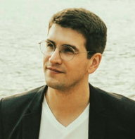

---
---

<link rel="stylesheet" href="styles.css" type="text/css">

Alex is a social scientist and statistician who is passionate about using statistical modeling and sound research designs to answer questions and build products. He has extensive experience designing, managing, and analyzing randomized experiments; using statistical methods and predictive modeling to generate actionable insights from data; and communicating results to technical and non-technical audiences.

Alex completed his undergraduate degree in economics at the university of Toronto, and graduate coursework in economics and statistics at the New School for Social Research and Columbia University in New York City.  He specializes in machine learning and randomized experiments for measurement and prediction, with applications in politics, policy, market research, and technology companies.
